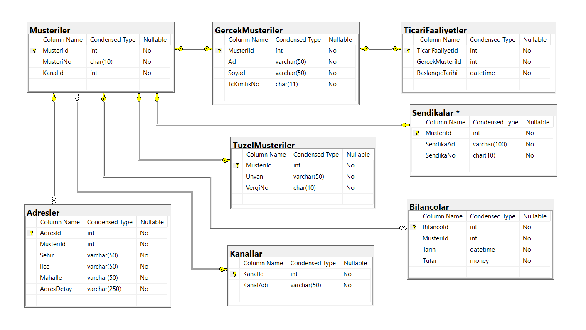

### BankaDb
Kurumsal Mimariler için Sql Server Veri Tabanı Tasarımı

#### Senaryo
Gereksinim: ABC Bankası olarak müşterilerimizin takibini yapabilmeliyiz.
 
Kabul Kriterleri:
- İki tip müşterimiz mevcut. Gerçek Müşteriler, Tüzel Müşteriler.
- Gerçek Müşteri: MüşteriNo, Ad, Soyad, TcKimlikNo alanlarına sahiptir.
- Tüzel Müşteri: MüşteriNo, Unvan, VergiNo alanlarına sahiptir.
- Müşterilerin adreslerini takip edebilmeliyiz.
- Tüzel Müşterilerin bilanço bilgilerini kaydetmeliyiz. Bilanço bilgisi olarak bilanço tutarı ve bilanço tarihi bilgisini tutmak yeterlidir.
- Gerçek Müşterilerin bazıları Ticari Faaliyet gerçekleştirmektedir. Bu tip müşterilerimiz için de bilanço takibi yapabilmeliyiz.
- Bir kişinin veya kurumun bankamızın müşterisi olabilmesi için çeşitli kanallar mevcuttur. (İnternet, Şube vb.) Müşterinin hangi kanaldan bankamıza ilk kez katıldığı bilgisini de tutmak istiyoruz.

#### Banka Müşteri Yönetim Diyagramı - Kısmi Veritabanı Tasarımı
